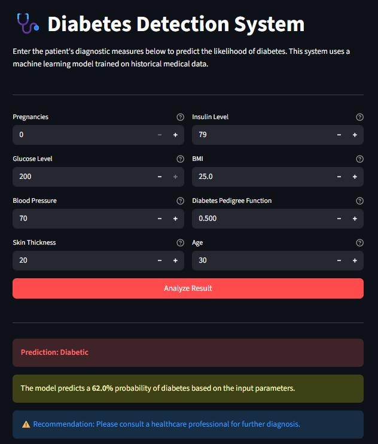

# 🩺 Diabetes Prediction App

A machine learning web application that predicts the likelihood of diabetes in a patient based on clinical diagnostic measurements. Built using a **Random Forest Classifier** trained on the **PIMA Indian Diabetes Dataset** from Kaggle, and deployed live via **Streamlit**.

[](https://zwcwzzu9aygdddtnk9aw5t.streamlit.app/)

---

## 🚀 Live Demo

🔗 [Click here to try the app](https://zwcwzzu9aygdddtnk9aw5t.streamlit.app/)

---

## 🖼️ App Screenshot



---

## 📌 Project Overview

This project aims to assist in the early detection of diabetes by taking key medical parameters as input and predicting whether the patient is diabetic or non-diabetic. Two classification models were evaluated — **Logistic Regression** and **Random Forest** — with Random Forest selected as the final model due to its superior accuracy and recall on the diabetic class.

---

## 📊 Dataset

- **Source:** [PIMA Indian Diabetes Dataset – Kaggle](https://www.kaggle.com/datasets/uciml/pima-indians-diabetes-database)
- **Records:** 768 patient entries
- **Features:** 8 clinical input features + 1 target variable
- **Target:** `Outcome` — 1 (Diabetic), 0 (Non-Diabetic)

| Feature | Description |
|---|---|
| Pregnancies | Number of times pregnant |
| Glucose | Plasma glucose concentration (2-hour oral glucose tolerance test) |
| BloodPressure | Diastolic blood pressure (mm Hg) |
| SkinThickness | Triceps skinfold thickness (mm) |
| Insulin | 2-hour serum insulin (µU/ml) |
| BMI | Body Mass Index (weight in kg / height in m²) |
| DiabetesPedigreeFunction | Diabetes pedigree function (genetic risk score) |
| Age | Age in years |

---

## 🧠 Model Details

| Model | Accuracy | Notes |
|---|---|---|
| Logistic Regression | 71.4% | Lower recall on diabetic class |
| **Random Forest** | **77.3%** | **Selected — better F1 and recall** |

**Final Model:** `RandomForestClassifier(class_weight='balanced', random_state=42)`

- `class_weight='balanced'` used to handle class imbalance in the dataset
- Features scaled using `StandardScaler` before training
- Model and scaler saved together as `diabetes_model_final.pkl` using `joblib`

**Random Forest — Classification Report (Test Set):**

```
              precision    recall    f1-score   support
           0       0.80      0.87      0.83       100
           1       0.71      0.59      0.65        54
    accuracy                           0.77       154
```

---

## 🛠️ Tech Stack

| Layer | Technology |
|---|---|
| Language | Python 3.x |
| ML Libraries | scikit-learn, NumPy, pandas |
| Visualization | Matplotlib, Seaborn |
| Model Serialization | joblib |
| Web App | Streamlit |
| Deployment | Streamlit Cloud |

---

## 📁 Project Structure

```
diabetes-prediction-app/
│
├── app.py                        # Streamlit web application
├── diabetes_model_final.pkl      # Trained Random Forest model + scaler
├── diabetes.csv                  # PIMA Indian Diabetes dataset
├── Diabetes_detection.ipynb      # EDA, training, and model evaluation notebook
├── requirements.txt              # Python dependencies
└── README.md                     # Project documentation
```

---

## ⚙️ Run Locally

1. **Clone the repository**
   ```bash
   git clone https://github.com/<your-username>/diabetes-prediction-app.git
   cd diabetes-prediction-app
   ```

2. **Install dependencies**
   ```bash
   pip install -r requirements.txt
   ```

3. **Run the Streamlit app**
   ```bash
   streamlit run app.py
   ```

4. Open your browser at `http://localhost:8501`

---

## 📈 Workflow

```
Raw Data (CSV)
     │
     ▼
Exploratory Data Analysis (EDA)
     │
     ▼
Data Preprocessing (StandardScaler)
     │
     ▼
Model Training (Logistic Regression + Random Forest)
     │
     ▼
Model Evaluation & Selection (Random Forest — 77.3%)
     │
     ▼
Model Serialization (joblib → .pkl)
     │
     ▼
Streamlit Web App → Deployed on Streamlit Cloud
```

---

## ⚠️ Disclaimer

This application is built for **educational and demonstration purposes only**. It is **not** a substitute for professional medical advice, diagnosis, or treatment. Always consult a qualified healthcare provider for medical decisions.

---

## 👤 Author

**Navneet**
- 📧 [navneetnitin.ece87@gmail.com]
- 💼 [https://www.linkedin.com/in/navneet-nitin/]
- 🐙 [https://github.com/navneet-nitin]

---

## 📄 License

This project is licensed under the [MIT License](LICENSE).
